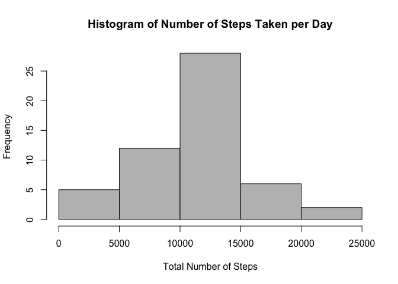
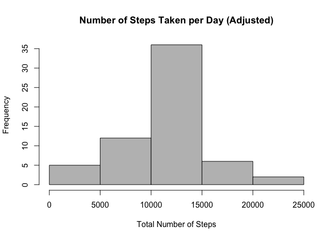
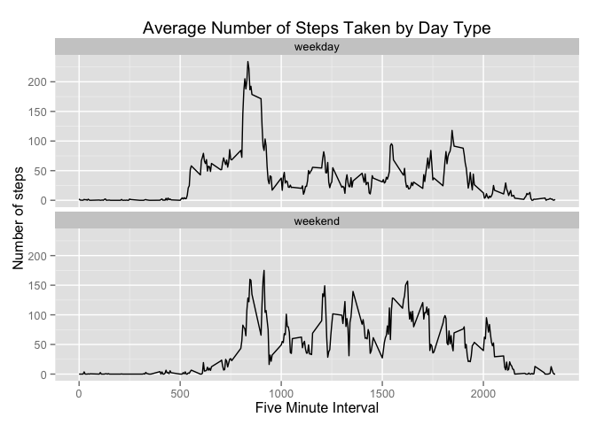

# Reproducible Research: Peer Assessment 1


## Loading and preprocessing the data

#### 1. Loading the data

```r
data <- read.csv("activity.csv", header = TRUE)
```

#### 2. Checking the data structure

```r
- head(data)
- tail(data)
- dim(data)
```

#### 3. Formatting the dates

```r
data$date <- as.Date(data$date, "%Y-%m-%d")
```

## What is mean total number of steps taken per day?

#### 1. Calculating the total number of steps taken each day

```r
stepsbyday <- aggregate(steps ~ date, data = data, sum)
```

#### 2. Making the histogram of the data

```r
hist(stepsbyday$steps, col = 8, main = "Histogram of Number of Steps Taken per Day", 
     xlab = "Total Number of Steps")
```

 

#### 3. Calculating Mean and Median of total number of steps taken per day

```r
meanSteps <- format(mean(stepsbyday$steps, na.rm = TRUE))

medianSteps <- format(median(stepsbyday$steps, na.rm = TRUE))
```
The mean total number of steps taken per day is 10766 and the median is 10765.

## What is the average daily activity pattern?

#### 1. Calculating the average steps taken

```r
meanInterval <- aggregate(steps~interval, data, mean, na.rm = TRUE)
```

#### 2. Creating the time series plot

```r
plot(meanInterval$interval, meanInterval$steps, type = "l", 
     main = "Average Number of Steps Taken by 5-Minute Interval", 
     xlab="5-Minute Interval",
     ylab="Average Number of Steps Across all Days")
```

 

#### 3. Calculating the 5-minute interval, on average across all the days in the dataset, that contains the maximum number of steps

```r
maxSteps <- round(max(meanInterval$steps),1)

maxInterval <- meanInterval$interval[which.max(meanInterval$steps)]
```
The 5-minute interval, on average across all the days in the dataset, that contains the maximum number of steps is 835.

## Imputing missing values

#### 1. Total number of missing values in the dataset

```r
missingRecords <- sum(is.na(data$steps))
```

#### 2. Replace missing step values with the mean for the entire observation period using the average for the entire observation period

```r
stepfill = vector()
for (item in data$steps) {
        if (is.na(item)) { # if a step is missing
                stepfill = append(stepfill, mean(data$steps, na.rm = TRUE)) # return the mean 
        } else {
                stepfill = append(stepfill, item)
        }        
}
```
The strategy used to replca missing data was to calculate average number of steps for the entire observation period.


#### 3. Create a new dataset that is equal to the original dataset but with the missing data filled in.

```r
dataFull <- data
dataFull$steps <- stepfill
```

#### 4. Calculating the total number of steps taken each day

```r
stepsbydayNew = aggregate(steps ~ date, data = dataFull, sum)
```

#### 5. Histogram of the total number of steps taken each day

```r
hist(stepsbydayNew$steps, col = 8, main="Number of Steps Taken per Day (Adjusted)",
     xlab="Total Number of Steps")
```

 

#### 6. Calculating the mean and median total number of steps taken per day

```r
newMean <- format(mean(stepsbydayNew$steps, na.rm = TRUE)) 
newMedian <- format(median(stepsbydayNew$steps, na.rm = TRUE))
```

## Are there differences in activity patterns between weekdays and weekends?

#### 1. Setting the date format

```r
data$date <- as.Date(data$date, "%Y-%m-%d")
```

#### 2. Adding a new column indicating day of the week 

```r
data$day <- weekdays(data$date)
```

#### 3. Adding a new column for day_type to identify the weekday

```r
data$day_type <- c("weekday")
```

#### 4. Making the day_type as weekend if the day is Saturday or Sunday

```r
for (i in 1:nrow(data)){
        if (data$day[i] == "Saturday" || data$day[i] == "Sunday"){
                data$day_type[i] <- "weekend"
        }
}
```

#### 5. Changing the day_type data type

```r
data$day_type <- as.factor(data$day_type)
```

#### 6. Adding the mean steps in the day_type intervals 

```r
interval_steps <- aggregate(steps ~ interval + day_type, data, mean)
```

#### 7. Loading ggplot2 for plotting the results

```r
library(ggplot2)
```

#### 8. Plotting the results

```r
qplot(interval, steps, data = interval_steps, geom=c("line"), xlab="Five Minute Interval", 
      ylab = "Number of steps", main = "Average Number of Steps Taken by Day Type") + facet_wrap(~ day_type, ncol=1)
```

 
